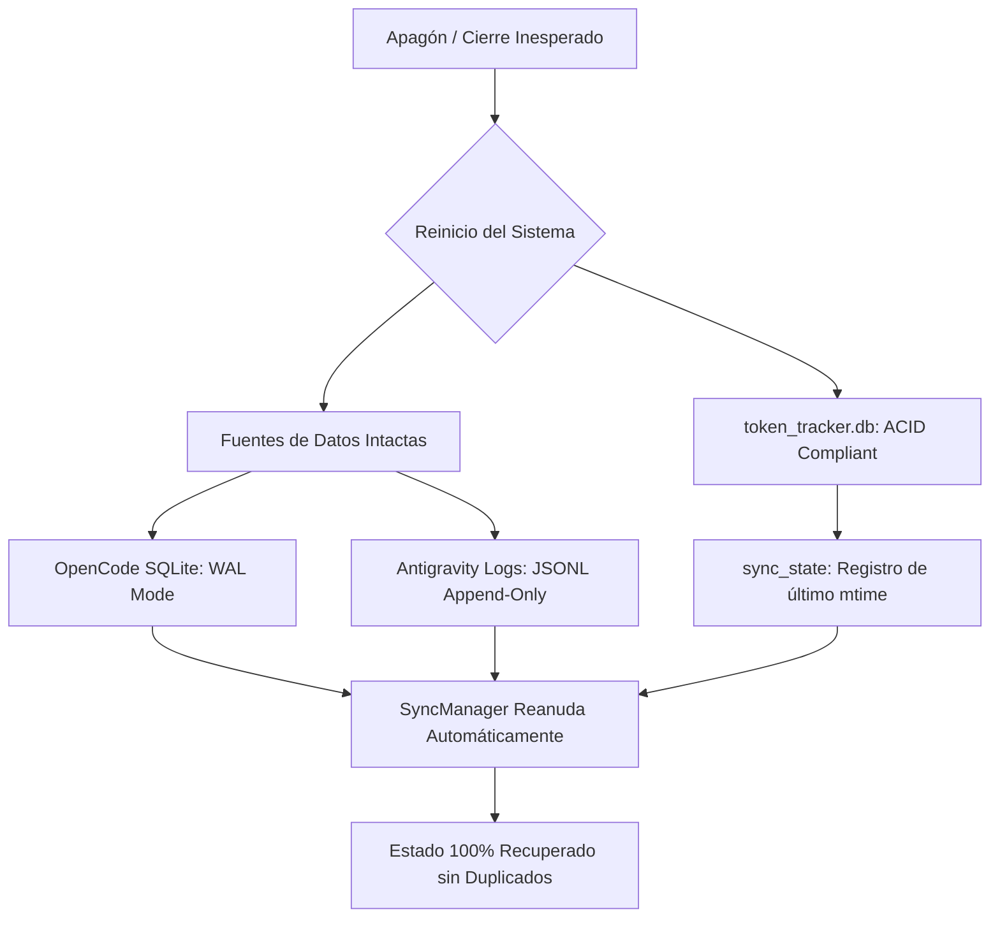

# 🛡️ Documentación Preventiva y Manual de Resiliencia ante Interrupciones

> [!IMPORTANT]
> **Propósito:** Esta documentación preventiva garantiza que el sistema **TokenPulse AI** (Contador y Auditor de Tokens y Costes) mantenga su integridad y pueda recuperarse de inmediato sin pérdida de datos en caso de apagones imprevistos del equipo, reinicios forzados, fallos de energía o cierres inesperados de aplicaciones.

---

## 1. Arquitectura de Resiliencia (¿Por qué no se pierden los datos?)

El sistema fue diseñado con una arquitectura **idempotente y tolerante a fallos**:



### Principios de Protección de Datos Implementados:
1. **Modo de Lectura Aislado (`mode=ro`):**
   * Al consultar `~/.local/share/opencode/opencode.db`, el colector usa conexiones de solo lectura con URI SQLite. Nunca bloquea ni corrompe la base de datos de OpenCode, incluso si OpenCode se apaga a mitad de escritura.
2. **Idempotencia de Sincronización (`sync_state` & `ON CONFLICT DO UPDATE`):**
   * Si el equipo se apaga a mitad de un proceso de sincronización, la tabla `sync_state` solo actualiza el puntero de archivo (`mtime`) cuando la sesión fue almacenada exitosamente. Al reiniciar, el sistema reanuda exactamente donde se interrumpió sin generar duplicados.
3. **Persistencia Local Descentralizada por Proyecto:**
   * Cada proyecto vinculado guarda su propio archivo local en `.tokenpulse/config.json` y `.tokenpulse/events.jsonl`, de modo que el historial del proyecto existe tanto dentro de su propia carpeta como en la base de datos central `token_tracker.db`.

---

## 2. Protocolo Rápido de Recuperación tras un Apagón

Si tu equipo se apagó repentinamente o se cerró la consola, sigue estos 3 pasos:

### Paso 1: Ejecutar Diagnóstico de Salud
Abre tu terminal en la carpeta del proyecto y ejecuta:
```powershell
python check_health.py
```
* **Qué hace:** Verifica la integridad física de SQLite (`PRAGMA integrity_check`), comprueba la accesibilidad de OpenCode y Antigravity, valida el puerto 4120 y ejecuta una sincronización de prueba.
* **Resultado esperado:** `✅ ESTADO GENERAL: SISTEMA 100% OPERATIVO Y RESILIENTE`.

### Paso 2: Iniciar el Servidor Dashboard
```powershell
python main.py
```
*(O si solo deseas consultar los números en terminal sin abrir el navegador: `python main.py --sync-only`)*

### Paso 3: Abrir el Dashboard en el Navegador
Accede a:
👉 **[http://localhost:4120](http://localhost:4120)**

---

## 3. Matriz de Resolución de Problemas (Troubleshooting)

| Síntoma o Error | Causa Probable | Solución Inmediata |
| :--- | :--- | :--- |
| **Error: `[WinError 10048]` Solo se permite un uso de cada dirección de socket** | Un proceso de Python anterior quedó bloqueando el puerto 4120 tras el corte. | Ejecuta en PowerShell para liberar el puerto:<br>`Get-Process python -ErrorAction SilentlyContinue \| Stop-Process -Force`<br>O arranca en otro puerto: `python main.py --port 4125`. |
| **Error: `[WinError 32]` Proceso no tiene acceso al archivo `token_tracker.db`** | El archivo quedó con un lock activo de Windows. | Cierra procesos huérfanos de Python con:<br>`taskkill /F /IM python.exe`<br>Y vuelve a arrancar con `python main.py`. |
| **Faltan sesiones recientes tras un reinicio** | Los archivos de logs no se habían sincronizado en memoria antes del apagón. | Haz clic en el botón **"Sincronizar"** en la esquina superior derecha del Dashboard o ejecuta `python main.py --sync-only`. |
| **La base de datos se reporta dañada (`PRAGMA integrity_check != ok`)** | Daño severo en el disco durante el corte de corriente. | La base central es un índice consolidado regenerable. Solo elimina `token_tracker.db` y ejecuta `python main.py`: regenerará el 100% de los datos desde las fuentes originales en segundos. |

---

## 4. Directorio de Archivos Críticos y Rutas

| Archivo / Directorio | Ubicación en el Equipo | Función y Criticidad |
| :--- | :--- | :--- |
| **Base Central del Tracker** | `c:\...\Contador de tokens\token_tracker.db` | **Crítico:** Contiene todas las sesiones normalizadas, proyectos registrados y eventos de comandos. |
| **Tarifas de Modelos** | `c:\...\Contador de tokens\backend\pricing_models.json` | **Configuración:** Precios en USD por millón de tokens para cada modelo de IA. |
| **Base Original OpenCode** | `C:\Users\Sebastian Macias\.local\share\opencode\opencode.db` | **Fuente Externa:** Historial nativo de OpenCode Desktop. |
| **Logs Originales Antigravity** | `C:\Users\Sebastian Macias\.gemini\antigravity-ide\brain\` | **Fuente Externa:** Transcripciones de sesiones y llamadas a herramientas. |
| **Paquete por Proyecto** | `<CarpetaDelProyecto>\.tokenpulse\config.json` | **Descentralizado:** Identificador canónico y límites de presupuesto del proyecto. |
| **Diagnóstico de Salud** | `c:\...\Contador de tokens\check_health.py` | **Mantenimiento:** Script para validación rápida en 1 comando. |

---

## 5. Registro de Estado Vivo del Proyecto (Changelog de Solicitudes)

> [!NOTE]
> Esta sección se actualizará continuamente con cada nueva solicitud para mantener trazabilidad exacta de los módulos activos.

### 📌 Solicitud 1: Creación del Núcleo de TokenPulse AI
* **Fecha:** 2026-10-06 19:32
* **Objetivo:** Contador de tokens de gasto para Antigravity IDE y OpenCode Desktop, con instalación de Graphify y Caveman.
* **Componentes Implementados:**
  * Colectores `OpenCodeCollector` y `AntigravityCollector`.
  * Instalación de `graphifyy` (v0.9.79) y `JuliusBrussee/caveman` (v3.1).
  * Backend FastAPI con base de datos SQLite y servidor Uvicorn.
  * Dashboard web inicial en tiempo real.

### 📌 Solicitud 2: Contabilidad Específica por Proyectos e IAs Desglosadas
* **Fecha:** 2026-10-06 20:11
* **Objetivo:** Contabilidad por proyectos, paquete modular para carpetas, vista dedicada en la app con cada IA por separado y línea temporal histórica.
* **Componentes Implementados:**
  * Paquete modular CLI `tokenpulse` (`init`, `status`, `log`).
  * Tablas `registered_projects` y `project_events` en SQLite.
  * Selector interactivo de proyectos en la interfaz web.
  * Tabla **"Inteligencias Artificiales en este Proyecto"** con desglose por cada IA (Gemini, DeepSeek, Claude, etc.) de tokens in/out/thinking y coste en USD.
  * Gráfico temporal histórico del proyecto desde su inicio hasta hoy.
  * Modales web para vincular proyectos y registrar comandos manuales.

### 📌 Solicitud 3: Documentación Preventiva y Diagnóstico Automático
* **Fecha:** 2026-10-06 20:41
* **Objetivo:** Protección contra apagones, interrupciones o salidas accidentales, con protocolo de recuperación y actualización viva en cada iteración.
* **Componentes Implementados:**
  * Creación de `check_health.py` (diagnóstico automático de SQLite, fuentes externas, puertos y sincronización).
  * Redacción de `DOCUMENTACION_PREVENTIVA.md` con matriz de contingencia y guías de recuperación.
  * Protocolo de mantenimiento de estado vivo para futuras solicitudes.

### 📌 Solicitud 4: Publicación y Versionado en GitHub
* **Fecha:** 2026-10-06 21:06
* **Objetivo:** Creación y publicación del repositorio público en GitHub con control de versiones.
* **Componentes Implementados:**
  * Creación de `.gitignore` optimizado para excluir bases de datos locales y temporales.
  * Archivo `requirements.txt` para reproducción exacta de dependencias.
  * Inicialización del repositorio Git local con rama `main`.
  * Publicación remota en GitHub con visibilidad pública (`gh repo create`).

### 📌 Solicitud 5: Portabilidad Multi-Dispositivo y Auto-Descubrimiento
* **Fecha:** 2026-10-06 22:10
* **Objetivo:** Arquitectura para traslado entre computadores, ubicación óptima de proyectos y auto-descubrimiento.
* **Componentes Implementados:**
  * Comando CLI `python -m tokenpulse scan` y botón web para auto-descubrir y vincular proyectos en masa.
  * Identificador universal e independiente de la máquina vía Git Remote URL (`git config --get remote.origin.url`).
  * Endpoint y botón para exportar reportes de auditoría en Markdown (`/api/projects/{name}/export`).
  * Manual de traslado y alojamiento de proyectos en nuevos dispositivos.

---

## 6. Guía de Portabilidad: Traslado a Nuevos Computadores

### A. ¿Dónde deben alojarse los proyectos?
Para garantizar máxima eficiencia, se aconseja mantener una **carpeta raíz unificada de desarrollo**:
* **En Windows:** `C:\Users\<TuUsuario>\Documents\0. Programacion\` o `C:\Proyectos\`
* **En Linux/Mac:** `~/Documents/Proyectos/` o `~/Developer/`

Cada proyecto individual debe residir en su propia subcarpeta con su repositorio Git (ej: `CV-AUTO/`, `NOVA/`, `Grabadora_para_Escritores/`).

### B. ¿Cómo viaja la contabilidad si cambias de equipo?
1. **El Paquete Embebido (`.tokenpulse/`):**
   * Al hacer `git push` y `git pull` de tus proyectos, la carpeta `.tokenpulse/` viaja con el código fuente en GitHub.
2. **Identificador Portátil:**
   * TokenPulse asocia cada proyecto a su URL de GitHub (`https://github.com/Usuario/Repo.git`), por lo que no importa si la ruta absoluta de Windows cambia de `C:\Users\Sebastian\...` a `C:\Users\Otro\...`.
3. **Auto-Descubrimiento en 1 Clic:**
   * Al descargar o clonar TokenPulse en un nuevo computador, simplemente ejecuta:
     ```powershell
     python -m tokenpulse scan "C:\ruta\donde\tienes\tus\proyectos"
     ```
   * O en el Dashboard Web, presiona el botón **"Escanear Proyectos"**. El sistema detectará automáticamente todos los repositorios y reconstruirá la auditoría en 1 segundo.


---

### 📌 Solicitud 6: Expansión Multi-Modelo y Multi-IDE (Auditoría Universal de IA)
* **Fecha:** 2026-10-06 22:55
* **Objetivo:** Extender TokenPulse AI más allá de Antigravity y OpenCode, incorporando todas las inteligencias artificiales modernas y todos los IDEs y entornos de desarrollo AI detectables en el flujo de trabajo.
* **Componentes Implementados:**
  * **Catálogo de 41+ Modelos de IA:**
    * OpenAI (o1, o3-mini, GPT-4o, GPT-4o Mini, GPT-4 Turbo, GPT-3.5).
    * Anthropic Claude (Claude 3.7 Sonnet con Hybrid Reasoning, Claude 3.5 Sonnet, Claude 3.5 Haiku, Claude 3 Opus).
    * Google Gemini (Gemini 2.5 Pro, 3.8 Flash, 2.0 Flash, 2.0 Flash Thinking, 1.5 Pro, 1.5 Flash).
    * DeepSeek (DeepSeek-V3 `deepseek-chat`, DeepSeek-R1 `deepseek-reasoner`, DeepSeek Coder V2).
    * Meta Llama (Llama 3.3 70B, Llama 3.1 405B, 70B, 8B).
    * Mistral AI (Codestral 2501, Mistral Large 2, Mistral Small).
    * Alibaba Qwen (Qwen 2.5 Coder 32B, 7B, Qwen 2.5 72B).
    * Ollama / Local ($0.00 USD para inferencia offline en hardware local).
    * Modelos Gratuitos (DeepSeek V4 Flash Free, Nemotron 3 Ultra Free, Mimo V2.5 Free, Big Pickle).
  * **Arquitectura de Detección y Colectores Multi-IDE:**
    * `backend/ide_detector.py`: Servicio de detección que audita Antigravity, OpenCode, Claude Code, Ollama, VS Code (Cline/Roo/Copilot), Cursor, Windsurf, Continue.dev y Aider.
    * Colectores especializados: `ClaudeCodeCollector`, `ContinueCollector`, `AiderCollector`, `CursorWindsurfCollector`, `VSCodeAICollector`, `OllamaCollector`.
    * Integración centralizada en `SyncManager.sync_all()`.
  * **Interfaz Web Mejorada (Dashboard 1.2):**
    * **Barra Hub "Entornos e IDEs Detectados":** Monitoreo en vivo de los 9 entornos con estado de conexión, insignias de colores y filtro instantáneo.
    * **Modal de Tarifas con Pestañas por Proveedor:** Filtrado interactivo por proveedor de IA (Google, Anthropic, OpenAI, DeepSeek, Meta, Mistral, Qwen, Ollama, Gratuitos).
    * **Soporte de Registro Manual Multi-IDE:** Registro de eventos vinculados a cualquier IDE y modelo.

---

## 7. Arquitectura Multi-IDE y Colectores Disponibles

| Entorno / IDE | Proveedor / Tipo | Ruta Auditada | Colector |
| :--- | :--- | :--- | :--- |
| **Antigravity IDE** | Google DeepMind | `~/.gemini/antigravity-ide/brain/` | `antigravity_collector.py` |
| **OpenCode Desktop** | OpenCode AI | `~/.local/share/opencode/opencode.db` | `opencode_collector.py` |
| **Claude Code** | Anthropic | `~/.claude/` y `.claude.json` | `claude_collector.py` |
| **Ollama Local AI** | Offline Runtime | `~/.ollama/models/` | `ollama_collector.py` |
| **VS Code (Cline / Roo)** | Extensión VS Code | `AppData/Roaming/Code/User/globalStorage/` | `vscode_collector.py` |
| **Cursor AI** | Anysphere | `AppData/Roaming/Cursor/User/workspaceStorage/` | `cursor_collector.py` |
| **Windsurf Editor** | Codeium | `AppData/Roaming/Windsurf/User/workspaceStorage/` | `cursor_collector.py` |
| **Continue.dev** | Open Source | `~/.continue/sessions/` | `continue_collector.py` |
| **Aider Pair** | CLI Pair Tool | `.aider.chat.history.md` en proyectos | `aider_collector.py` |

---

## 8. Verificación y Pruebas del Sistema
Para validar que todos los colectores, la base de datos y el servidor web funcionan perfectamente:
```powershell
python check_health.py
```
Salida esperada: `5/5 verificaciones superadas con éxito`, reportando estado 100% operativo.
