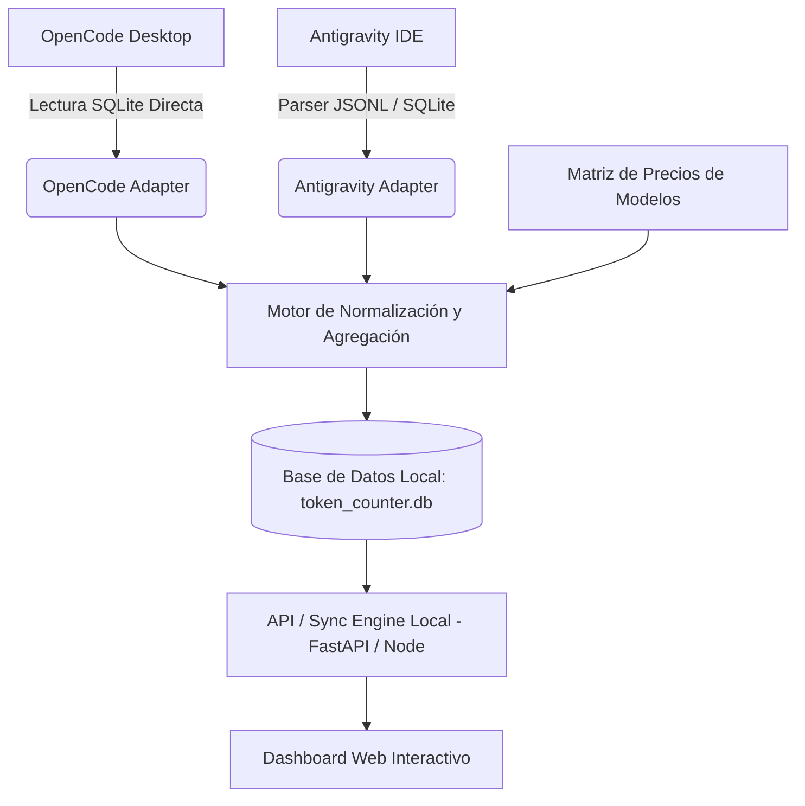

# Plan de Desarrollo: Contador de Tokens y Costes de IA
**Entornos objetivo:** Antigravity IDE & OpenCode Desktop  
**Herramientas de optimización:** Graphify (`graphifyy`) & Caveman  

---

## 1. Estado de Instalación de Herramientas Solicitadas

Ambas herramientas de optimización y ahorro de tokens han quedado instaladas y configuradas en el sistema:

| Herramienta | Versión / Origen | Configuración en Antigravity | Configuración en OpenCode |
| :--- | :--- | :--- | :--- |
| **Graphify** | `graphifyy` v0.9.79 (Python/uv) | `.agents/rules/graphify.md`, `.agents/workflows/graphify.md` y `.agents/skills/graphify` | `.opencode/plugins/graphify.js` (hook `tool.execute.before`) y regla en `AGENTS.md` |
| **Caveman** | `JuliusBrussee/caveman` (v3.1) | `.agents/skills/caveman/SKILL.md` integrado en el espacio de trabajo | `.config/opencode/plugins/caveman`, 9 skills, 8 comandos (`/caveman`, `/caveman-stats`, etc.) y `opencode.jsonc` |

---

## 2. Hallazgos Técnicos de los IDEs en su Equipo

Tras la inspección local en su sistema Windows, se identificaron con exactitud los puntos de conexión y datos disponibles:

### A. OpenCode Desktop
* **Ubicación local:** `C:\Users\Sebastian Macias\.local\share\opencode\opencode.db` (Base de datos SQLite activa).
* **Estructura encontrada:**
  * Tabla `session`: Almacena métricas nativas y exactas: `tokens_input`, `tokens_output`, `tokens_reasoning`, `tokens_cache_read`, `tokens_cache_write`, `cost`, `model`, `directory`, `time_created`, `time_updated`.
  * Tabla `message`: Guarda cada turno con marcas de tiempo individuales y metadatos de modelo.
* **Diagnóstico actual verificado en su máquina:**
  * **130 sesiones** registradas actualmente.
  * **15,884,675 tokens de entrada** y **1,840,578 tokens de salida**.
  * Modelos registrados: DeepSeek V4 Flash, Big Pickle, Nemotron, Mimo, etc.

### B. Antigravity IDE
* **Ubicación local:** 
  * `C:\Users\Sebastian Macias\.gemini\antigravity-ide\brain\<conversation-id>\.system_generated\logs\transcript_full.jsonl`
  * `C:\Users\Sebastian Macias\.gemini\antigravity-ide\conversations\<conversation-id>.db`
* **Estructura encontrada:**
  * **118 conversaciones** históricas en `brain/`.
  * Los archivos `transcript_full.jsonl` registran cronológicamente cada paso: inputs de usuario (`USER_INPUT`), respuestas del modelo (`PLANNER_RESPONSE` con pensamiento `thinking` y llamadas a herramientas `tool_calls`), salidas de ejecución (`RUN_COMMAND`, `VIEW_FILE`), y cambios de configuración de modelo (`USER_SETTINGS_CHANGE`, ej. Gemini 3.8 Flash, Gemini 2.5 Pro).
* **Mecanismo de captura:** Dado que Antigravity no almacena un contador monetario en crudo de fábrica, se calculan tokens mediante un motor BPE/tokenizador rápido sobre los eventos del transcript y se aplican las tarifas oficiales de Gemini (Flash/Pro) y modelos asociados.

---

## 3. ¿Para qué Servirá Específicamente el Proyecto?

1. **Visibilidad Financiera Unificada:** Dashboard único que consolida el gasto y tokens consumidos tanto en Antigravity IDE como en OpenCode Desktop sin depender de interfaces separadas.
2. **Medición del Ahorro (ROI) con Graphify y Caveman:** Gráficas comparativas de gasto por sesión antes y después de activar Caveman (compresión de respuestas) y Graphify (navegación AST para evitar lecturas masivas de archivos).
3. **Presupuestos y Alertas en Tiempo Real:** Alertas visuales o notificaciones cuando una sesión o jornada sobrepase un umbral configurado (ej. 500k tokens o $2.00 USD).
4. **Desglose Multidimensional:**
   * Por Proyecto/Directorio de trabajo.
   * Por Modelo (Gemini Flash vs Pro vs DeepSeek vs Claude).
   * Por Tipo de Token (Input, Output, Reasoning/Thinking, Cache Read/Write).
   * Línea de tiempo (hoy, últimos 7 días, mensual).

---

## 4. Arquitectura Propuesta del Contador de Tokens

### Componentes Clave:
1. **Colector OpenCode (`opencode_collector.py`):**
   * Conexión de solo lectura en modo WAL a `~/.local/share/opencode/opencode.db`.
   * Extracción de sesiones y sumatorias instantáneas.
2. **Colector Antigravity (`antigravity_collector.py`):**
   * Observador de la carpeta `~/.gemini/antigravity-ide/brain/`.
   * Lector incremental de `transcript_full.jsonl`.
   * Motor de tokenización (utilizando `tiktoken` / tokenizador por BPE o ratio ponderado de caracteres por token) que cuantifica tokens de entrada (contexto + prompts + outputs de herramientas) y tokens de salida (pensamiento + texto generado).
3. **Motor de Tarifas (`pricing_engine.json`):**
   * Tabla configurable con el costo por millón de tokens para cada modelo (Gemini 2.5 Pro, Gemini 3.8 Flash, DeepSeek V4, Claude 3.5, etc.).
4. **Almacén Unificado (`token_tracker.db`):**
   * Base de datos local SQLite ligera que unifica eventos, sesiones, fechas, proyectos y costos calculados.
5. **Dashboard Visual (Frontend):**
   * Interfaz web moderna (modo oscuro, diseño reactivo, gráficos de barras/líneas, métricas KPI destacadas).

---

## 5. Fases de Implementación Sugeridas

### Fase 1: Prototipo de Ingesta y Extracción (Backend Core) — [COMPLETADO ✅]
* Módulos extractores para OpenCode y Antigravity implementados.
* Cálculo de tokens y asociación de precios por modelo activos.
* Agregación histórica consolidada de 227 sesiones.

### Fase 2: Almacenamiento Unificado y Sincronizador Automático — [COMPLETADO ✅]
* Base de datos unificada SQLite (`token_tracker.db`) en modo WAL.
* Sincronizador periódico en segundo plano (`SyncManager`) cada 30 segundos.

### Fase 3: API Local y Servidor de Métricas — [COMPLETADO ✅]
* Servicio FastAPI ligero con endpoints `/api/stats`, `/api/projects`, `/api/sessions`, `/api/pricing`, `/api/ides/status`, `/api/export`.

### Fase 4: Dashboard Interactivo y Panel de Control — [COMPLETADO ✅]
* Vista Global y Vista de Proyecto con KPIs en tiempo real, gráficas cronológicas y explorador de sesiones.

### Fase 5: Portabilidad y Auto-Descubrimiento en Masa — [COMPLETADO ✅]
* Paquete CLI `python -m tokenpulse scan` para auto-vincular proyectos masivamente.
* Identificación portable mediante Git Remote URL (`remote.origin.url`).
* Exportación de informes forenses en Markdown.

### Fase 6: Expansión Multi-IDE y Multi-Modelo — [COMPLETADO ✅]
* Detección y colectores para 9 IDEs (Antigravity, OpenCode, Claude Code, Cursor, Windsurf, VS Code, Continue, Aider, Ollama).
* Catálogo de 41+ modelos de IA con filtros por proveedor y registro manual universal.

### Fase 7: Filtro Temporal y Selector de Fechas (v1.3.0) — [COMPLETADO ✅]
* Carga predeterminada en el día presente ("Hoy") para control de gasto en tiempo real.
* Presets rápidos: 1 Día, 3 Días, 1 Semana, 1 Mes, Todo el Histórico.
* Selector de calendario con retroactividad ilimitada hasta el inicio del registro histórico (`2026-05-16`).
* Métricas KPI duales (período seleccionado vs histórico total acumulado).

### Fase 8: Explorador de Disco, Verificador Inteligente, Visibilidad y Adopción Externa (v1.3.5) — [COMPLETADO ✅]
* **Explorador interactivo de carpetas:** Navegación en disco y selección de proyectos en tiempo real dentro del modal de vinculación.
* **Verificador inteligente y anti-falsos positivos:** Resolución canónica (`resolve_canonical_project`) que escala hacia la raíz del repositorio, evitando que subcarpetas o archivos individuales se registren erróneamente como proyectos.
* **Consolidación de base de datos:** Reclasificación de 17 sesiones dispersas en sus proyectos raíz canónicos.
* **Favoritos (⭐) y Ocultar Carpetas (👁️):** Filtros rápidos (`📁 Todos`, `⭐ Favoritos`, `👁️ Ocultos`) con prioridad en el selector y listado.
* **Modal de Ajustes de Visibilidad (`⚙️ Visibilidad`):** Interruptor maestro para ocultar los 7 IDEs inactivos/desconectados, checkboxes para los 9 IDEs y filtro de modelos no utilizados.
* **Empaquetado Estándar (`pyproject.toml`):** Instalable globalmente mediante `pip install -e .`.
* **SDK Python de Medición (`tokenpulse.tracker`):** Instrumentación en 2 líneas con `TokenTracker`, `track_usage` y decorador `@tracker.track()` tolerante a fallos para proyectos externos (FastAPI, bots, Ren'Py, etc.).
* **Insignia Dinámica SVG (`/api/projects/{name}/badge.svg`):** Shield badge para incrustar en cualquier `README.md`.
* **Guía de Integración:** Creada `GUIA_INTEGRACION_Y_ADOPCION.md`.

